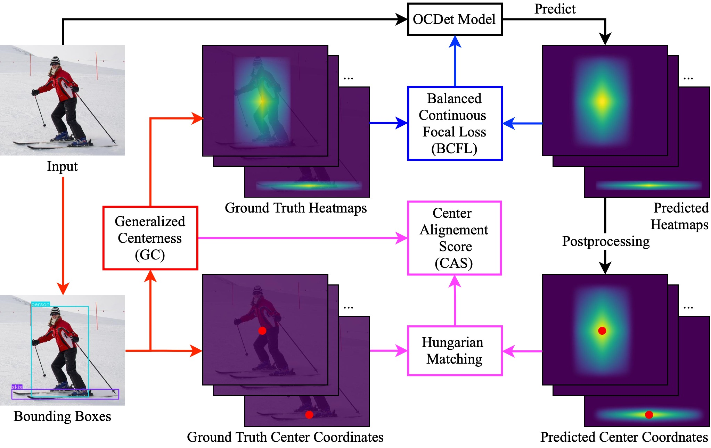
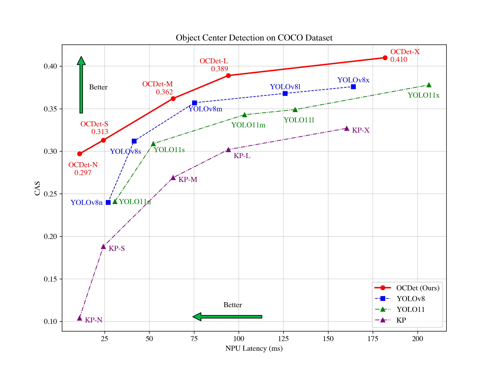
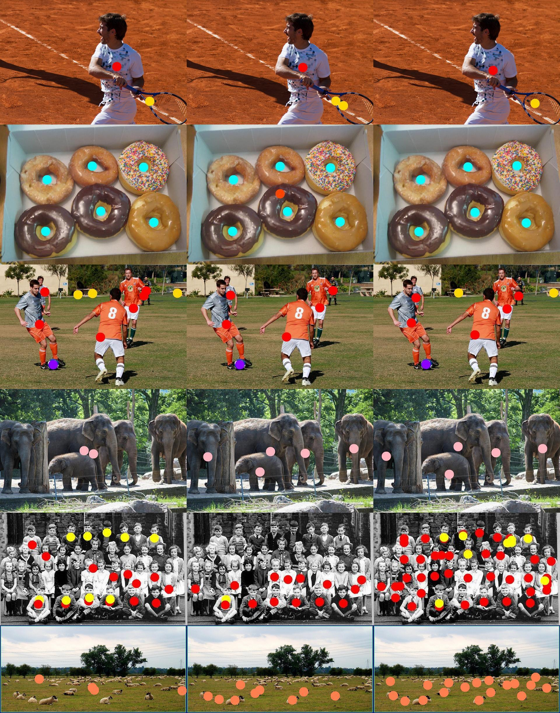
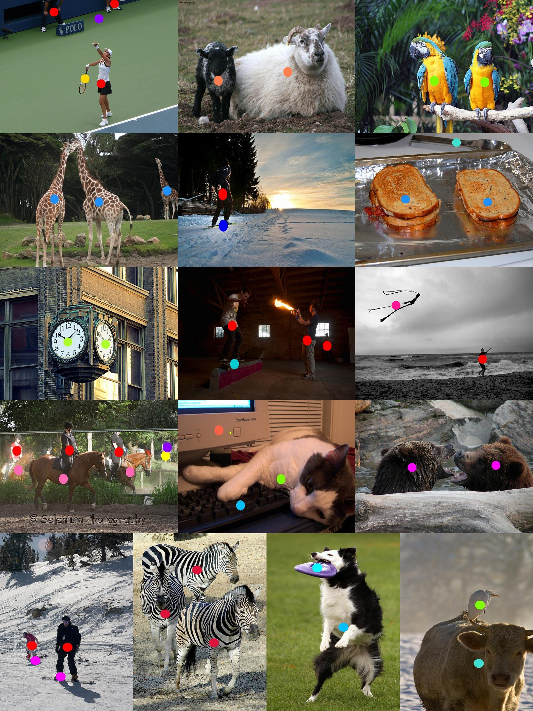

# OCDet: Object Center Detection via Bounding Box-Aware Heatmap Prediction on Edge Devices with NPUs


## Introduction

We introduce OCDet, a lightweight Object Center Detection framework optimized for edge devices with NPUs. OCDet predicts heatmaps representing object center probabilities and extracts center points through peak identification. Unlike prior methods using fixed Gaussian distribution, we introduce Generalized Centerness (GC) to generate ground truth heatmaps from bounding box annotations, providing finer spatial details without additional manual labeling. Built on NPU-friendly Semantic FPN with MobileNetV4 backbones, OCDet models are trained by our Balanced Continuous Focal Loss (BCFL), which alleviates data imbalance and focuses training on hard negative examples for probability regression tasks. Leveraging the novel Center Alignment Score (CAS) with Hungarian matching, we demonstrate that OCDet consistently outperforms YOLO11 in object center detection, achieving up to 23\% higher CAS while requiring 42\% fewer parameters, 34\% less computation, and 64\% lower NPU latency. When compared to keypoint detection frameworks, OCDet achieves substantial CAS improvements up to 186\% using identical models. 





## Performance


## Model Zoo

### COCO 80-class Object Center Detection (OCDet)

| **Model**     | **#Params.<br><small>(M)** | **FLOPs<br><small>(G)** | **NPU Latency<br><small>i.MX 8M Plus<br>(ms)** | **CAS ↑** | **CP ↓** | **MD ↓** | **P ↑** | **R ↑** | **F1 ↑** |
|---------------|:---------------:|:------------:|:---------------:|:---------:|:--------:|:--------:|:-------:|:-------:|:-------:|
| [OCDet-N](https://syncandshare.lrz.de/getlink/fi5ezAwSvU6mmCYqkZZ5ee/ocdet-n.pt)  |      1.51       |     0.54     |      10.94      |   0.297   |   0.645  |   0.059  |  0.634  |  0.466  |  0.510  |
| [OCDet-S](https://syncandshare.lrz.de/getlink/fiN8KSYwTr8wZtWSeL3q3Q/ocdet-s.pt)  |      1.59       |     0.94     |      24.25      |   0.313   |   0.644  |   0.055  |  0.621  |  0.507  |  0.531  |
| [OCDet-M](https://syncandshare.lrz.de/getlink/fiVf3hVP1hJoFzphu7VPSH/ocdet-m.pt)  |      8.25       |     3.54     |      63.26      |   0.362   |   0.573  |   0.065  |  0.643  |  0.585  |  0.599  |
| [OCDet-L](https://syncandshare.lrz.de/getlink/fiPDATASirWqeBgarTkcDJ/ocdet-l.pt)  |     31.88       |     7.67     |      94.14      |   0.389   |   0.563  |   0.064  |  0.694  |  0.596  |  0.630  |
| [OCDet-X](https://syncandshare.lrz.de/getlink/fiXExH2uXCYiuAuvuZotmH/ocdet-x.pt)  |     22.20       |     7.00     |     181.81      |   0.410   |   0.525  |   0.066  |  0.713  |  0.643  |  0.669  |

### Person Center Detection (PCDet)

| **Model**     | **#Params.<br><small>(M)** | **FLOPs<br><small>(G)** | **NPU Latency<br><small>i.MX 8M Plus<br>(ms)** | **CAS ↑** | **CP ↓** | **MD ↓** | **P ↑** | **R ↑** | **F1 ↑** |
|---------------|:---------------:|:------------:|:---------------:|:---------:|:--------:|:--------:|:-------:|:-------:|:-------:|
| [PCDet-N](https://syncandshare.lrz.de/getlink/fiFyeYrHB8MX9j9mFBz9hU/pcdet-n.pt)  |      1.51       |     0.52     |      9.99      |   0.472   |   0.440  |   0.088  |  0.815  |  0.745  |  0.779  |
| [PCDet-S](https://syncandshare.lrz.de/getlink/fiVoRtZ29k7ztK2AWCcN2F/pcdet-s.pt)  |      1.59       |     0.92     |      18.41      |   0.506   |   0.411  |   0.083  |  0.830  |  0.762  |  0.794 |
| [PCDet-M](https://syncandshare.lrz.de/getlink/fiAYEppW33CfxZFonZYnXR/pcdet-m.pt)  |      7.79       |     2.75     |      39.68     |   0.546   |   0.379  |   0.075  |  0.910  |  0.715  |  0.801  |
| [PCDet-L](https://syncandshare.lrz.de/getlink/fi5mLNUbAwqvkUKNSKRkUH/pcdet-l.pt)  |     30.96       |     6.06     |      60.47      |   0.557   |   0.366  |   0.077  |  0.894  |  0.750  |  0.816  |
| [PCDet-X](https://syncandshare.lrz.de/getlink/fiHRbMuUYubBfbuRb5hUsZ/pcdet-x.pt)  |     21.91       |     6.49     |     160.37      |   0.582   |   0.337  |   0.081  |  0.831  |  0.848  |  0.840  |

## Model Configurations

The model configurations are organized and stored in the [`configs`](configs) directory. This folder is structured as follows:

- [`configs/cmap`](configs/cmap/) contains configurations for Person Center Detection (PCDet) models, tailored for detecting person only.

- [`configs/cmap_c80`](configs/cmap_c80/) includes configurations for Object Center Detection (OCDet) models trained on COCO’s 80 object classes.

## Install

### 1. Create a Conda Environment
```
conda create -n ocdet python=3.10
conda activate ocdet
```

### 2. Install the Required Dependencies

```
pip install -r requirements.txt
```

### 3. Install mmdetection and mmsegmentation
```
pip install -U openmim
mim install mmengine
mim install "mmcv==2.1.0"
mim install mmdet
pip install "mmsegmentation>=1.0.0"
```

## Inference

### 1. Download Model Weights 

Download the pretrained weights from the [Model Zoo](#model-zoo) and save them in `weights` directory.

### 2. Run inference on GPU/CPU

You can perform inference with any model on either a GPU or CPU. Below are examples demonstrating both scenarios.

#### Object Center Detection with OCDet-X on GPU
To detect centers for 80 COCO categories across all images in the images folder using OCDet-X on a GPU, use the following command:

```
python predict.py \
  --input_path images \
  --trained weights/ocdet-x.pt \
  --config configs/cmap_c80/ocdet-x.yaml \
  --n_classes 80 \
  --gpu 0 \
  --min_distance 3 \
  --threshold_abs 0.5 \
  --input_size 320 \
  --vis \
  --save

```

#### Person Center Detection with OCDet-N on CPU

To perform center detection specifically for the "person" category on a single image (images/000000032081.jpg) using PCDet-N on a CPU, execute the following command:

```
python predict.py \
  --input_path images/000000032081.jpg \
  --trained weights/pcdet-n.pt \
  --config configs/cmap/pcdet-n.yaml \
  --n_classes 1 \
  --gpu -1 \
  --min_distance 3 \
  --threshold_abs 0.5 \
  --input_size 320 \
  --vis \
  --save
```

## Training

### 1. Prepare Dataset

Download and extract the [COCO Dataset](http://cocodataset.org). The directory structure should look like this:

```
COCO_FOLDER/
  annotations/  # annotation json files
  train2017/    # train images
  val2017/      # val images
```

### 2. Generate Ground Truth Heatmaps 

Generate ground truth heatmap for both `val2017` and `train2017` images using the proposed **Generalized Centerness**:

```
python datasets/generate_gt_heatmap_ocdet_coco.py
python datasets/generate_gt_heatmap_ocdet_coco.py --train
```

Generated heatmaps are saved in `COCO_FOLDER/cmaps`

### 3. Run Training Script

For example, to train OCDet-N:

```
python train.py --task=cmap_c80 -p ocdet --config=ocdet-n --vis --wandb
```

The best model is saved in `torch_models` folder locally

## Evaluation

For example, to evaluate the OCDet-S model for 80-class object center detection on COCO `val2017`:

```
python eval.py --task cmap_c80 \
               --project ocdet \
               --trained weights/ocdet-s.pt \
               --config ocdet-s \
               --vis \
               --wandb
```

## NPU Inference

To run inference on NPU, trained PyTorch models must first be converted to TensorFlow Lite (tflite) with uint8 quantization.

### 1. Model Conversion and Quantization

Follow the examples provided in [convert.ipynb](conversion/convert.ipynb)

### 2. Inference on NPU

Check the script [tflite_inference.py](conversion/tf)

## Qualitative Results

### Comparison of Ground Truth (left), YOLO11x (center), and OCDet-X (right)



### More Visualizations of OCDet-X's Predictions




